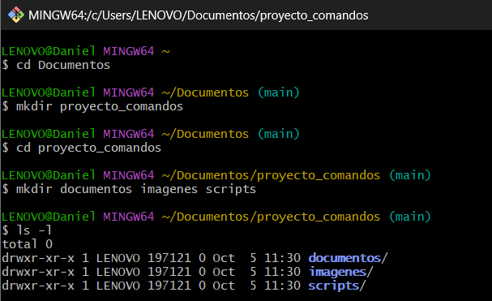
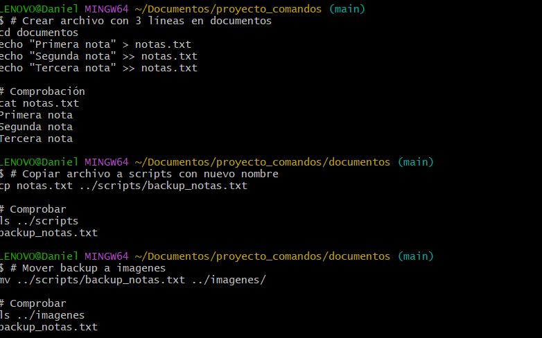
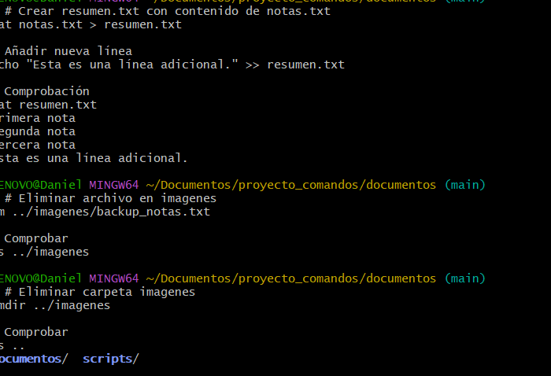
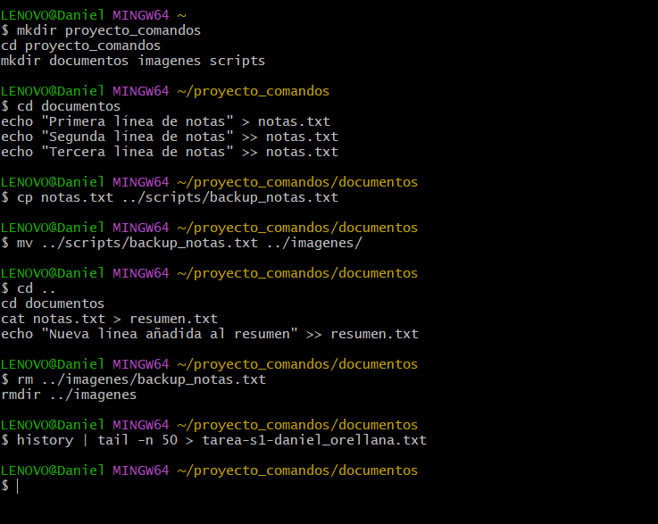

# Práctica de Comandos Linux y Git
## 1. Título
 comandos Linux básicos 

## 2. Tiempo de duración
2 horas para desarrollar la práctica completa

## 3. Fundamentos:

Los comandos de Linux son herramientas fundamentales para la administración de sistemas y el desarrollo de software. En esta práctica se utilizan comandos básicos del sistema operativo que permiten la manipulación de archivos y directorios de forma eficiente desde la terminal.

**Comandos principales utilizados:**

- `mkdir`: Crea directorios y subdirectorios de forma recursiva con la opción `-p`
- `echo`: Muestra texto en pantalla y permite redireccionar contenido a archivos
- `cat`: Muestra el contenido completo de archivos de texto
- `cp`: Copia archivos y directorios manteniendo el contenido original
- `mv`: Mueve o renombra archivos y directorios
- `rm`: Elimina archivos del sistema de archivos
- `ls`: Lista el contenido de directorios con diferentes opciones de formato
- `tail`: Muestra las últimas líneas de un archivo
- `history`: Muestra el historial de comandos ejecutados
- `tee`: Permite duplicar la salida, mostrándola en pantalla y guardándola en archivo

**Redirección de entrada/salida:**
- `>`: Redirecciona la salida a un archivo (sobrescribe)
- `>>`: Redirecciona la salidab a un archivo (añade al final)
- `|`: Pipe, conecta la salida de un comando con la entrada de otro

**Control de versiones Git:**
Git es un sistema de control de versiones distribuido que permite rastrear cambios en archivos y coordinar el trabajo entre múltiples desarrolladores. Los comandos básicos incluyen `add`, `commit` y `push` para gestionar el flujo de trabajo.

## 4. Conocimientos previos.
   
Para realizar esta práctica el estudiante necesita tener claro los siguientes temas:
- Comandos básicos de Linux/terminal
- Navegación en sistema de archivos
- Conceptos de redirección de entrada/salida
- Fundamentos de Git y control de versiones
- Manejo básico de editores de texto (nano)

## 5. Objetivos a alcanzar
   
- Crear estructura de directorios usando comandos de terminal
- Manipular archivos de texto con redirección de entrada/salida
- Realizar operaciones de copia, movimiento y eliminación de archivos
- Implementar control de versiones básico con Git
- Generar archivos de historial para documentar el trabajo realizado

## 6. Equipo necesario:
  
- Computador con sistema operativo Windows/Linux
- Terminal o línea de comandos disponible
- Git instalado en el sistema
- Conexión a internet 

## 7. Material de apoyo.
   
- Documentación oficial de comandos Linux
- Guía de Git oficial
- Cheat sheet de comandos Linux básicos
- Manual de redirección en sistemas Unix/Linux

## 8. Procedimiento

**Paso 1:** Verificar la instalación de Git y navegar al directorio de trabajo
```bash
git --version
cd Documentos
```

**Paso 2:** Crear estructura de directorios del proyecto
```bash
mkdir -p proyecto_comandos/{documentos,imagenes,scripts}
ls -l proyecto_comandos
```

**Paso 3:** Crear archivo de notas con redirección de salida
```bash
echo "Primera línea de mis notas" > proyecto_comandos/documentos/notas.txt
echo "Segunda línea con una idea" >> proyecto_comandos/documentos/notas.txt
echo "Tercera línea — recordatorio" >> proyecto_comandos/documentos/notas.txt
```

**Paso 4:** Verificar contenido y editar archivo
```bash
cat proyecto_comandos/documentos/notas.txt
nano proyecto_comandos/documentos/notas.txt
```

**Paso 5:** Realizar copia de seguridad del archivo
```bash
cp proyecto_comandos/documentos/notas.txt proyecto_comandos/scripts/backup_notas.txt
ls -l proyecto_comandos/scripts

```

**Paso 6:** Mover archivo de backup a directorio de imágenes
```bash
mv proyecto_comandos/scripts/backup_notas.txt proyecto_comandos/imagenes/
ls -l proyecto_comandos/imagenes
```

**Paso 7:** Crear archivo resumen y agregar contenido adicional
```bash
cat proyecto_comandos/documentos/notas.txt > proyecto_comandos/documentos/resumen.txt
echo "Línea adicional añadida al resumen" >> proyecto_comandos/documentos/resumen.txt
tail -n 5 proyecto_comandos/documentos/resumen.txt
```

**Paso 8:** Limpiar archivos temporales y directorios vacíos
```bash
rm proyecto_comandos/imagenes/backup_notas.txt
if [ -z "$(ls -A proyecto_comandos/imagenes 2>/dev/null)" ]; then 
  rmdir proyecto_comandos/imagenes && echo "Carpeta imágenes eliminada (estaba vacía)."
else 
  echo "La carpeta imagenes NO está vacía. No se eliminará."
fi
```

**Paso 9:** Generar archivo de historial y confirmar en Git
```bash
history | tee tarea-s1-daniel_orellana.txt
git add tarea-s1-daniel_orellana.txt
git commit -m "Añadir tarea-s1 con historial"
git push origin main
```

Figura 1-1. Flujo de trabajo con comandos Linux y Git.

## 9. Resultados esperados:
    
Al finalizar la práctica se debe obtener:
- Estructura de directorios organizada con carpetas documentos y scripts
- Archivo notas.txt con contenido creado mediante redirección
- Archivo resumen.txt generado a partir del archivo de notas
- Archivo tarea-s1-daniel_orellana.txt con el historial completo de comandos
- Repositorio Git actualizado con los cambios confirmados y enviados al repositorio remoto
- Comprensión práctica de operaciones básicas de manipulación de archivos
- Experiencia en el uso de redirección de entrada/salida y pipes

## 10. Bibliografía

**Autor:** Daniel Orellana  
**Fecha:** 4 de octubre de 2025